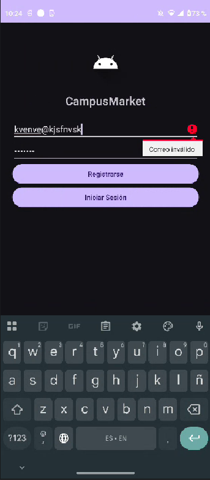
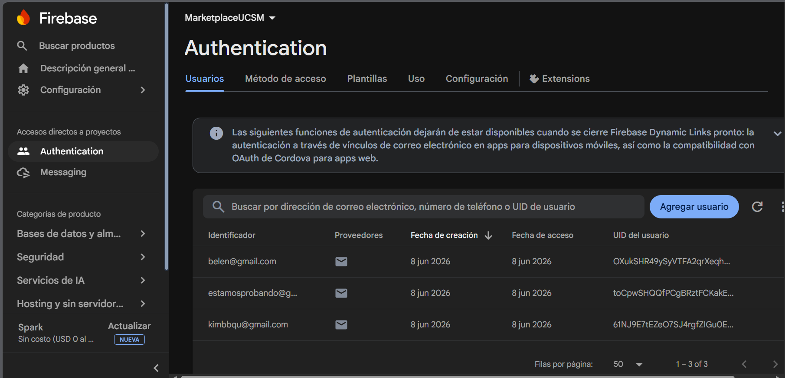
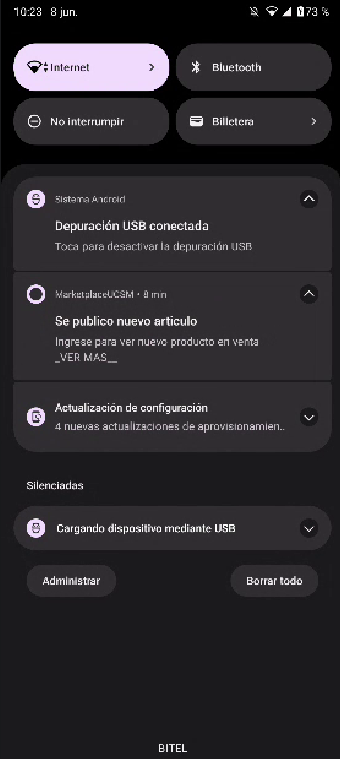
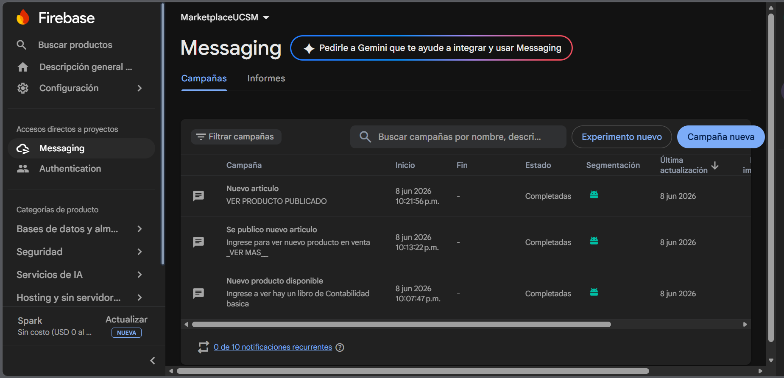

# Firebase Authentication y Firebase Cloud Messaging

## Descripción

En esta actividad se implementaron dos servicios de Firebase para Android utilizando Kotlin:

- Firebase Authentication para el registro e inicio de sesión de usuarios mediante correo electrónico y contraseña.
- Firebase Cloud Messaging (FCM) para el envío y recepción de notificaciones push en dispositivos Android.

---

## Tecnologías Utilizadas

- Kotlin
- Android Studio
- Firebase Authentication
- Firebase Cloud Messaging (FCM)
- Firebase Console

---

# Ejercicio 1: Firebase Authentication

Se implementó un sistema de autenticación utilizando Firebase Authentication que permite registrar e iniciar sesión mediante correo electrónico y contraseña. Además, se realizaron validaciones de formato de correo y longitud mínima de contraseña antes de registrar al usuario.

### Evidencias

#### Registro de usuario en la aplicación

#### Usuario registrado en Firebase Authentication

### Video Explicativo

📹 **Video:**  
[Dar click para ver video ](https://ucsmedu-my.sharepoint.com/:v:/g/personal/kimberly_barra_estudiante_ucsm_edu_pe/IQCecZeM5xuLR52aT-JGaKt8AXtkxFcH6MeKi2kV3wb9yQU?e=pq3BRF&nav=eyJyZWZlcnJhbEluZm8iOnsicmVmZXJyYWxBcHAiOiJTdHJlYW1XZWJBcHAiLCJyZWZlcnJhbFZpZXciOiJTaGFyZURpYWxvZy1MaW5rIiwicmVmZXJyYWxBcHBQbGF0Zm9ybSI6IldlYiIsInJlZmVycmFsTW9kZSI6InZpZXcifX0%3D)

---

# Ejercicio 2: Firebase Cloud Messaging (FCM)

Se integró Firebase Cloud Messaging para la gestión de notificaciones push. La aplicación genera un token único para el dispositivo y permite recibir notificaciones enviadas desde Firebase Console.

### Evidencias

#### Notificación recibida en el dispositivo móvil

#### Envío de notificación desde Firebase

### Funcionalidades implementadas

- Obtención del token FCM.
- Configuración de Firebase Messaging.
- Recepción de notificaciones push.
- Prueba de envío desde Firebase Console.
- Verificación de recepción en dispositivo Android.

---

## Autor

Kimberly BQ
